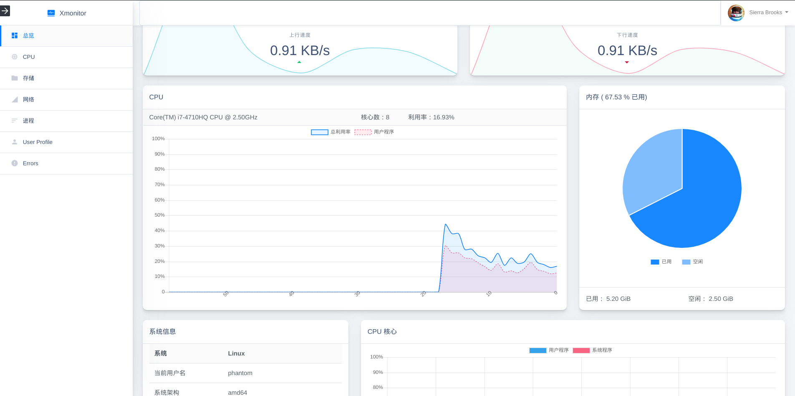

# xmonitor

---
CSS | [Bootstrap](https://getbootstrap.com/) [designrevision](https://designrevision.com/)
JS  | [jQuery](https://jquery.com/)
MVC | [SpringBoot](http://spring.io/projects/spring-boot)
SpringBoot + Thymeleaf + BootStrap + Guava + Lomback

一个系统监控系统，包括进程管理、CPU监控、内存监控...等
模块还在增减，敬请期待。
## Preview

## Thanks

Special thanks to [GA_engine](https://github.com/pikeszfish/GA_engine).
